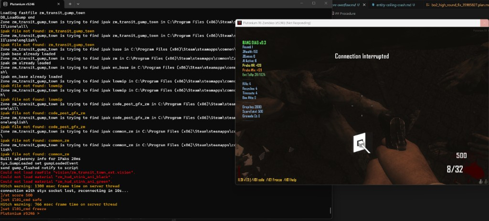

# Test IL-01: has_attachment() Infinite Loop (Baseline)

**Hypothesis:** `has_attachment(weapon, attachment)` contains a missing `idx++` in its inner while-loop. When the target attachment is not the first in the `+`-delimited weapon name, the loop spins on i=0 forever, freezing the server.

**Test script:** `scripts/zm_test_il01.gsc` — load this instead of diagnostics.

## Run Metadata

| Field           | Value |
|-----------------|-------|
| Date            | 2026-02-19 |
| Map             | zm_transit/Town (gump_town) |
| Player count    | Solo |
| Script versions | zm_test_il01.gsc v1.0 |
| Patch scripts   | none |

## Procedure

1. Load only `zm_test_il01.gsc`, start a game
2. Wait for the IL01 HUD element to appear
3. Run `/il01 safe` — both Variant A and B should complete with no freeze
4. Note results and screenshot
5. Run `/il01 freeze` — a 5-second countdown appears; let it proceed
6. Observe whether the server hangs

## Variant Results

| Variant | Call | Expected | Actual | Froze? |
|---------|------|----------|--------|--------|
| A | `has_attachment("an94_zm+reflex+grip", "reflex")` | `true` (no freeze) | `true` | NO |
| B | `has_attachment("an94_zm", "grip")` | `false` (no freeze) | `false` | NO |
| C | `has_attachment("an94_zm+reflex+grip", "grip")` | FREEZE | FREEZE | **YES** |

## Observations

- Variant A returned immediately. ✓
- Variant B returned immediately. ✓
- Variant C froze the server. **CONFIRMED.**

Console output at freeze (from screenshot):

```
Hitch warning: 1300 msec frame time on server thread
Hitch warning: 766 msec frame time on server thread
connection with styx socket lost, reconnecting in 10s...
```

Plutonium's server watchdog detected the hung main thread and terminated the connection, displaying "Connection Interrupted" on screen. The game process became "Not Responding" in the Windows title bar (visible in screenshot).

The diagnostics HUD was still rendering on-screen at the time of freeze, confirming the freeze is server-side (script execution halted) while the client render loop kept running briefly before the disconnect.



## Conclusion

**CONFIRMED:** `has_attachment()` with a non-first attachment freezes the server on Plutonium r5246. The engine has NOT patched this natively. The two "Hitch warning" messages (1300ms, 766ms) show the server thread spinning in the infinite while-loop before Plutonium's watchdog kills the connection.

Any in-game code path that calls `has_attachment()` with a weapon that has multiple attachments and the target is not the first one will hard-freeze the server. The PaP upgrade system calls this function frequently during high rounds, making it a realistic crash trigger in normal gameplay.
