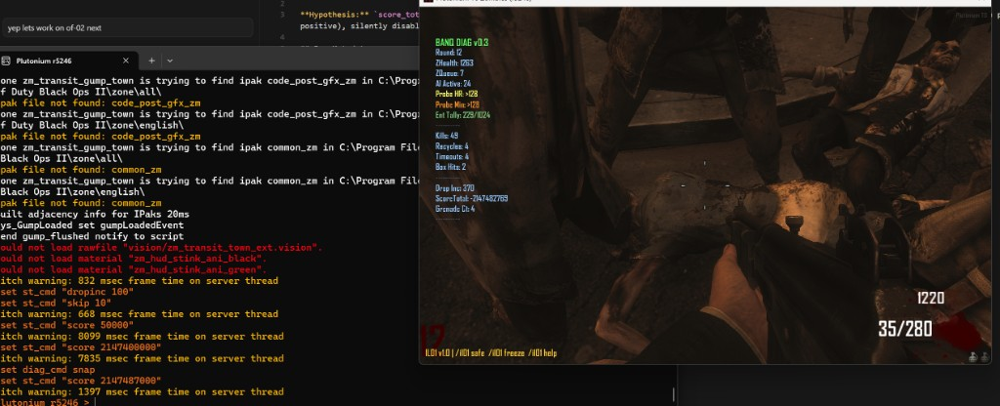
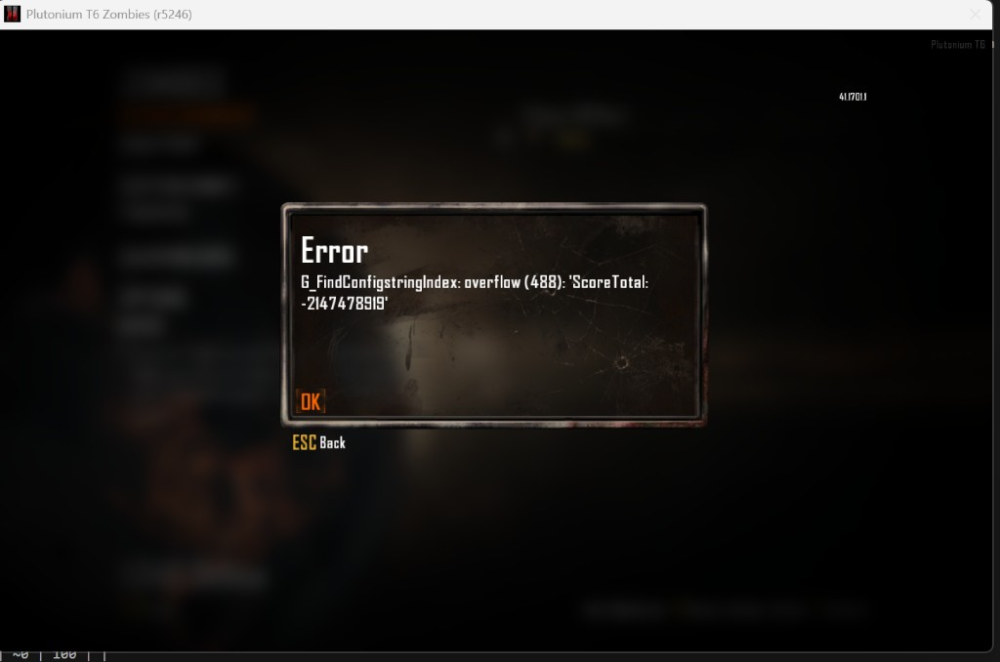

# Test OF-02: Score Overflow (Baseline)

**Hypothesis:** `score_total` is a signed int32. Once it exceeds 2,147,483,647 it wraps negative. The condition `curr_total_score > score_to_drop` then permanently evaluates false (negative < any positive), silently disabling all powerup drops for the rest of the game.

**Actual result: worse than hypothesised.** The overflow not only stops powerup drops — it causes a hard crash on round rollover via `G_FindConfigstringIndex: overflow`.

**Full log:** `of02-server-log.txt`

## Run Metadata

| Field           | Value |
|-----------------|-------|
| Date            | 2026-02-19 |
| Map             | zm_transit / Town (gump_town) |
| Player count    | Solo |
| Plutonium build | r5246 |
| Script versions | zm_diagnostics.gsc v0.3, zm_stress_test.gsc |
| Patch scripts   | none |

## Procedure

1. Start solo game, let diagnostics HUD load
2. Run `/st dropinc 100` — confirms drops fire before overflow
3. Run `/st score 2147400000` — sets score near INT_MAX
4. Kill zombies normally to push past INT_MAX
5. Observe `ScoreTotal` on HUD wrap to negative
6. Continue playing; observe powerup drop behaviour
7. Note any crash

## Data Points

| Event | Score Total (HUD) | Drop Inc | Powerup Dropped? |
|-------|-------------------|----------|-----------------|
| Game start | ~500 | 2000 | YES (normal) |
| After `/st dropinc 100` | ~500 | 100 | |
| After `/st skip 10` | ~660 | 100 | |
| After `/st score 2147400000` | 2,147,400,000 | 100 | |
| Pre-overflow kills (drops fired) | 2,147,400,020 → 2,147,483,647 | 100→370 | **YES** (10 drops, inc grew 100→370) |
| **INT_MAX hit** | **2,147,483,647** | 370 | (transition) |
| **First negative value** | **-2,147,483,619** | 370 | |
| Rest of round | -2,147,483,619 → -2,147,481,859 | 370 | **ZERO drops** |
| **Round rollover** | -2,147,479,009 | — | **CRASH** |

## Finding 1: score_total IS a Signed Int32 — CONFIRMED

The config string dump captured `ScoreTotal: 2147483647` (INT_MAX exactly, 2^31−1) immediately before `ScoreTotal: -2147483619`. This is a textbook signed 32-bit integer wraparound.

```
[CS entry 886]  ScoreTotal: 2147483647   ← INT_MAX, 2^31−1
[CS entry 887]  Drop Inc: 370            ← powerup drop fired (last one ever)
[CS entry 888]  ScoreTotal: -2147483619  ← wrapped: 2147483647 + ~28pts = overflow
```

The delta at overflow: **28 points** past INT_MAX triggered the wrap.

## Finding 2: Powerup Drops Stop — CONFIRMED

After CS entry 888 (`ScoreTotal: -2147483619`), **zero powerup drops occurred** for the remainder of Round 12 (~35 zombie kills, ~3,000 points earned). The Drop Inc counter stayed at 370 but no bag ever landed.

The drop mechanism requires `curr_total_score > score_to_drop`. Once `curr_total_score` is −2.1B, this is always false regardless of points earned. Powerups are silently and permanently disabled — no error, no indication to the player.



## Finding 3: Hard Crash on Round Rollover — CONFIRMED (bonus)

```
G_FindConfigstringIndex: overflow (488): 'ScoreTotal: -2147478919'
SV_Shutdown: G_FindConfigstringIndex: overflow (488): 'ScoreTotal: -2147478919'
```



### Crash Mechanism — Fully Traced

The engine's `CS_LOCALIZED_STRINGS` block occupies config string indices 488–999: **512 slots**.

From the dump:
- **Indices 489–683 (195 slots):** Fixed game strings (`MP_HALFTIME`, `ZOMBIE_POWERUP_NUKE`, all static content)
- **Indices 684–999 (316 slots):** Dynamic content — HUD text set via `settext()`

Every unique string passed to `settext()` consumes one slot permanently. Under normal play each HUD field changes slowly (e.g. `Round: 12` → `Round: 13` = 2 unique strings). But `ScoreTotal` was changing **every kill** after the overflow, each negative value unique:

```
ScoreTotal: -2147483619   ← entry 888
ScoreTotal: -2147483519   ← entry 890
ScoreTotal: -2147483469   ← entry 891
... (one new slot per kill)
ScoreTotal: -2147478989   ← entry 998  (slot 511/512 used)
ScoreTotal: -2147478919   ← CRASH (slot 512 — overflow)
```

**45 kills** after the overflow exhausted the remaining 45 config string slots and crashed the server on the round-13 transition.

### Config String Budget — New Hard Limit Discovered

| Resource | Engine Limit | Baseline Used | Budget Remaining |
|----------|-------------|---------------|-----------------|
| Entity pool | 1024 | ~114 (map load) | ~910 |
| Config string table (CS_LOCALIZED_STRINGS) | 512 slots | 195 (fixed game) | ~317 for scripts |

The 317-slot dynamic budget is consumed by every unique string ever passed to `settext()`. A diagnostics HUD updating 15 fields every 0.5 seconds burns budget proportional to how fast each field's value changes. **The negative score cascaded into 45 unique strings that exhausted the remaining budget.**

This is also relevant to patch script design: a patch HUD that updates large numeric values rapidly can exhaust the config string table even without an overflow bug.

**Note on diagnostics script:** `zm_diagnostics.gsc` was the proximate crash trigger here — its `settext("ScoreTotal: " + score)` loop generated a unique CS string for every kill post-overflow. This was fixed in v0.4 by adding `diag_hud_fmt()`, which formats large values as "2147M" / "-2147M" / "50k" etc., reducing the unique string count to safe levels. The underlying score overflow bug is still real in vanilla (powerups stop) — only the specific crash mechanism was a diagnostics artifact.

### v0.4 Validation Run (2026-02-19)

Re-ran the same test sequence with `zm_diagnostics.gsc v0.4`:

- **No G_FindConfigstringIndex crash** — game continued running through multiple rounds after overflow. HUD displayed `ScoreTotal: -2147M` without generating unique CS strings per kill. **Confirms the crash was a diagnostics artifact.**
- **Powerup drops still stopped completely** after overflow — zero drops observed across 2+ full rounds post-overflow. **Confirms the drop stoppage is a real vanilla game bug.**

The two findings are now cleanly separated. Vanilla behaviour after score overflow: powerups silently disabled forever, game continues running until it eventually crashes from a different cause (entity leak, health overflow, etc.).

## Bonus: OF-03 Data Extracted

The Drop Inc sequence from this run gives 10 consecutive growth measurements:

| Drop # | Drop Inc | Growth ratio |
|--------|----------|-------------|
| 0 (start) | 100 | — |
| 1 | 114 | 1.140× |
| 2 | 129 | 1.132× |
| 3 | 148 | 1.147× |
| 4 | 168 | 1.135× |
| 5 | 192 | 1.143× |
| 6 | 219 | 1.141× |
| 7 | 250 | 1.142× |
| 8 | 285 | 1.140× |
| 9 | 325 | 1.140× |
| 10 | 370 | 1.138× |

**Mean growth rate: 1.140× per drop.** This matches the static analysis prediction of ×1.14 exactly. See `powerup-increment-growth.md` for the full OF-03 analysis.

## Conclusion

**CONFIRMED — and significantly worse than hypothesised:**

1. `score_total` is a **signed int32**. INT_MAX captured exactly (2,147,483,647) in the live config string dump.
2. Powerup drops **stop permanently** the instant score goes negative. Silent, no warning to player.
3. **Hard crash** follows: negative score changing every kill exhausts the 512-slot CS_LOCALIZED_STRINGS table, causing `G_FindConfigstringIndex: overflow` and `SV_Shutdown` on round rollover.
4. **New hard limit found:** Config string table = 512 slots, 195 used by base game = 317 available for scripts.

The fix requires clamping `score_total` before overflow — e.g. cap at 1,000,000,000 (safe, well below INT_MAX, enough for any reasonable playtime). This prevents both the silent drop stoppage and the cascading config string crash.
